# Power.Co_Churn

## Table of Contents

* [Project Background](#project-background)

* [Project Goals](#project-goals)

* [Project Deep-Dive](#project-deep-dive)

    * [Data Overview](#data-overview)

        *[Client Data](#client-data)

        *[Pricing Data](#pricing-data)

  * [Churn and price sensitivity  hypothesis](#price-sensitivity-and-churn-hypothesis)

      * [Churn and client profile](#churn-and-client-profile)

      * [Price and date of modification](#price-and-date-of-modification)

  * [Recommendations](#recommendations)

* [Clarifying Questions, Assumptions, and Caveats](#clarifying-questions-assumptions-and-caveats)
    * [Questions for Stakeholders Prior to Project Advancement](#questions-for-stakeholders-prior-to-project-advancement)
    * [Assumptions and Caveats](#assumptions-and-caveats)

## Project Background
This project delivers a data science solution engineered by **BCG X** for **PowerCo**, an energy utility provider, to address customer attrition (**churn**). 

 PowerCo leadership operates under the hypothesis that **price sensitivity** is the primary driver of churn, assuming that customers migrate to competitors strictly to obtain lower volumetric or fixed utility rates.Therefore, this project directly investigates the validity of the price sensitivity hypothesis against alternative operational and behavioral variables.

Beyond hypothesis verification, the primary aim of this project is to build an end-to-end predictive framework and deliver actionable business recommendations.

## Project Goals

1. **Audits Client Profiles and Historical Pricing**: Audit customer profiles (electricity & gas consumption, sales channels, net margin etc,) and historical pricing structures and trends to handle **anomalies** and isolate **initial behavioral patterns**.

2. **Hypothesis Verification:** Quantifying the statistical correlation between historical price changes and customer exit rates to evaluate the economic viability of rate restructuring.

3. **Formulate Actionable Business Recommendations**: Translate empirical data insights and risk trends into targeted customer retention strategies, allowing PowerCo to protect annual contract value.

## Executive Summary

TBD
TBD
TBD
TBD

## Project Deep-Dive

### Data Overview

<table>
  <tr>
    <td valign="top" width="300" style="border: none;">
      
    </td>
    <td valign="top" style="border: none; padding-left: 20px;">

* The project utilizes two relational datasets(Client Data and Pricing Data) connected via a one-to-many relationship.

* client_data contains 14,606 rows $\times$ 27 columns and price_data contains 193,002 rows $\times$ 8 columns

* Too see detailed information, [Click here](Data/Data_Description.pdf)

    </td>
  </tr>
</table>

#### Client Data
To investigate distinct client profiles across the portfolio, we analyze four core metrics—electricity consumption, gas consumption, subscribed power, and net margin. Together, these define a client's overall footprint, highlighting how heavily a small cohort of enterprise accounts weights total operational and financial demand.

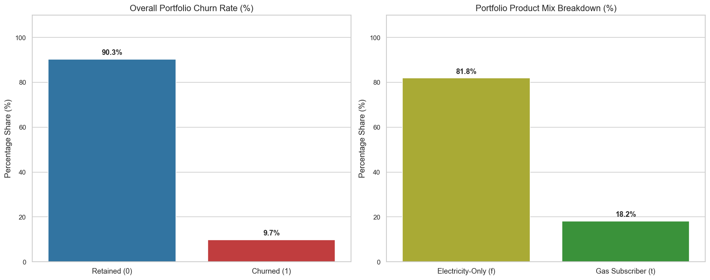

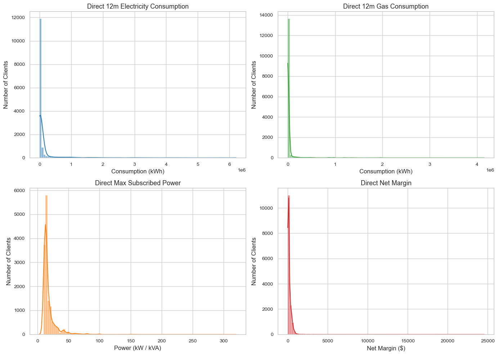
  Key Finding

* **The Baseline Churn Rate:** The overall churn rate for the portfolio sits at 9.7%，which means any customer segment or pricing pocket with an attrition rate significantly higher than 9.7% represents an elevated risk zone.

* **The Product Mix Structure**: The portfolio is heavily dominated by single-utility clients, with 81.8% of the customer base subscribing to electricity-only plans. Dual-fuel clients (gas subscribers) account for only 18.2% of the portfolio, confirming that gas functions as a smaller, auxiliary product line.

* **Structural Skewness:** All operational and financial features exhibit heavy right-skewness. This indicates that PowerCo's portfolio is heavily built on Small and Medium Enterprises (SMEs), with a long tail of high-volume industrial outliers.

* **Financial Risk Implication:** Most customers generate low margins. This makes overall company profitability highly vulnerable to the loss or churn of a few high-value accounts.

#### Pricing Data

To investigate price fluctuations and seasonality, we must plot fixed fees and variable rates separately because their completely.By applying Min-Max Normalization to scale all values between $0.0$ and $1.0$, 
we can directly compare the exact timing and velocity of price changes across off-peak, peak, and mid-peak windows.
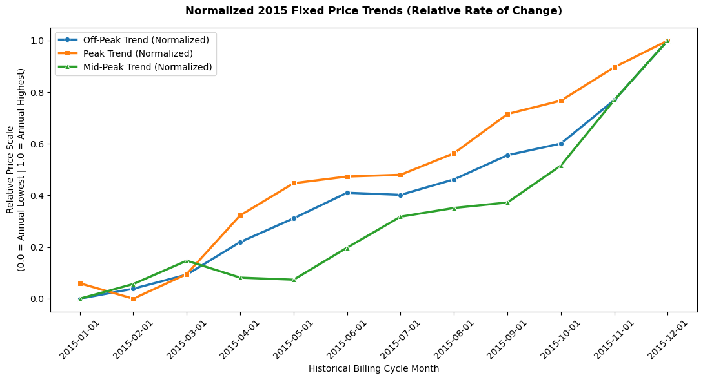

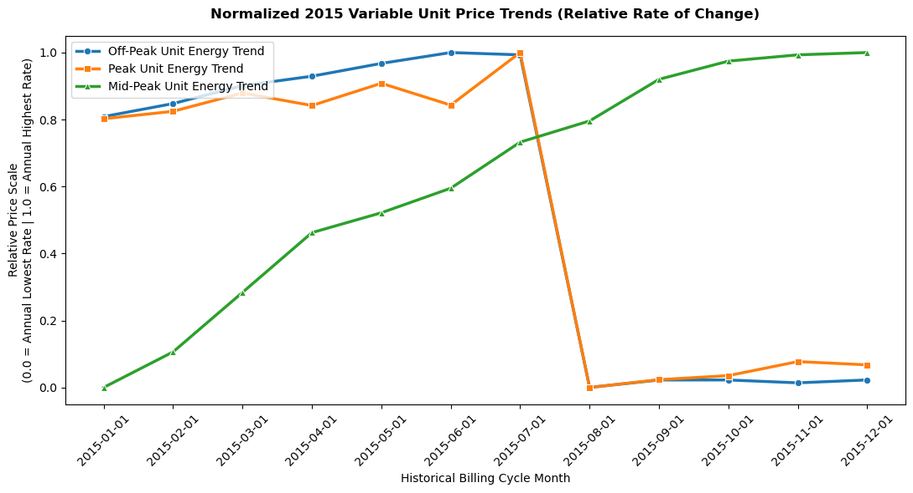

key findings: 

* **Controlled Growth in Fixed Costs** : Fixed fees across all time periods show a steady, near-linear upward trajectory throughout 2015. 

* **The Summer Collapse in Variable Rates :** variable unit energy rates expose a massive pricing anomaly around August, where off-peak and peak rates crashed from their annual highs ($1.0$) down to their annual lows ($0.0$). Meanwhile, mid-peak rates decoupled entirely from this crash, continuing a steady climb through December.

### price sensitivity and churn hypothesis

To address the client's request, we are testing our churn and price sensitivity hypotheses. 

Unfortunately, we cannot directly link cost changes with churn behavior; commercial B2B clients operate under fixed-term agreements and rarely exit mid-cycle due to steep penalties. Customer attrition is structurally restricted to the natural expiration of the contract (date_end). Consequently, price dissatisfaction acts as a lagging indicator, suppressing the visible decision to churn until the official renewal window opens.

However, we can discover patterns by analyzing churn rates against client profiles. Furthermore, we can evaluate the time metrics of price fluctuations alongside the exact date clients last modified their product subscription (date_modif_prod) to see if plan updates correlate with long-term retention.

#### Churn and client profile

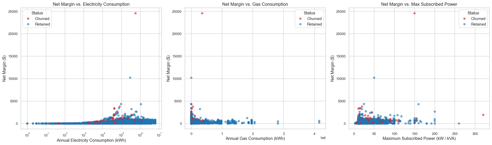

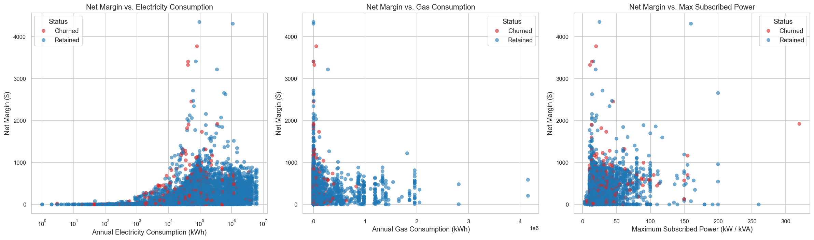

key findings: 

* **High-Value Churn Vulnerability** : The unfiltered view exposes severe revenue risk, dominated by a single churned client at the absolute top of the scale. This single account generates nearly $25,000 in net margin, proving that the loss of just one high-margin outlier can financially equal losing hundreds of standard core clients combined.  

* **Uniform Churn Risk Across Margin Levels:** Churn is not a behavior exclusive to low-margin or unprofitable clients. The red "Churned" data points are distributed evenly alongside the blue "Retained" points from the very bottom of the margin scale up past $1,000, meaning a client's specific profit margin profile does not inherently link with their churning behavior

#### Price and date of modification

We need to define the scope carefully, since the price history data only covers the year of 2015, clients with `date_end` prior to Jan 1st, 2016 should not be included. Besides, We need to mostly pay attention to those who had modified their product subscription during 2015 when investigating client behavior with price fluctuation. 

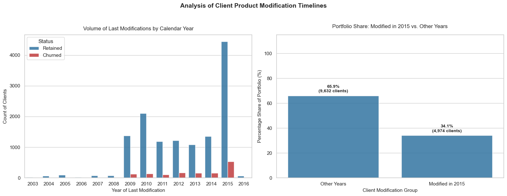

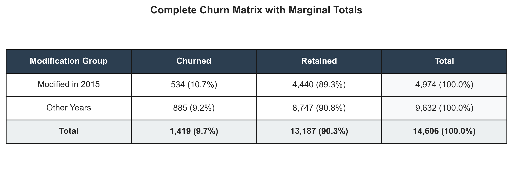

##### 1:  The 2015 Modification Spike

* **Observation:** there is the massive concentration of account modification activity in a single: 34.1% or more of clients last modified their product subscriptions during 2015, and only 14.9% (2,176 clients) hold contracts that were last modified in any other year (spanning from 2003 up to 2016).

* **What this means:** the 2015 spike  indicates a major structural event occurred in 2015. This was likely a forced migration, a massive pricing update, a company-wide campaign, or a large batch of legacy contracts all expiring simultaneously, forcing clients to select new terms.

##### 2. The Churn Rate Breakdown

* **Observation:**
Modified in 2015: 9.8% Churn Rate (1,215 lost clients / 11,215 retained).
Other Years: 9.4% Churn Rate (204 lost clients / 1,972 retained)

* **What this means:** Clients who touched their accounts in 2015 are churning at a slightly higher rate than clients sitting on older (or newer) legacy plans.

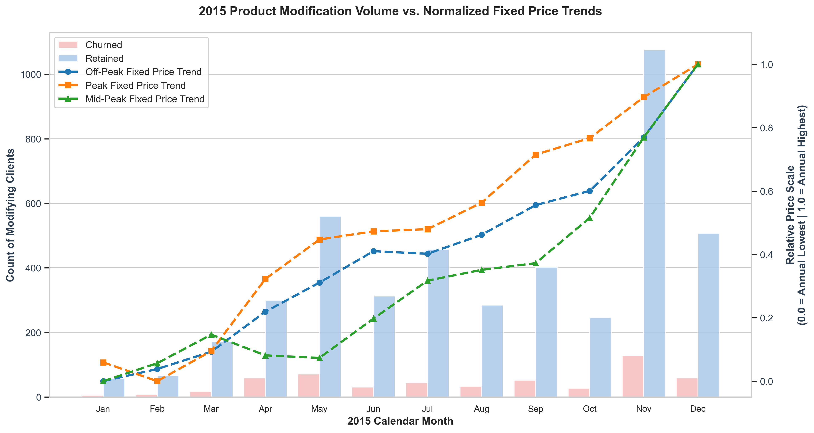

##### 1. The Fixed Price Chart

* **Observation:** Overall, the modification volume (bars) strongly correlates with the volatility of fixed capacity rates (lines). Following eight months of relative price stability and negligible account activity, a sudden, sharp spike in the Peak fixed rate in September triggered a massive, sustained surge in modifications throughout Q4.

* **What it means:** This lagging correlation proves that account attrition is highly event-driven; enterprise clients will passively accept stable base rates but will immediately and defensively renegotiate or downgrade their contracts in response to sudden pricing shocks.

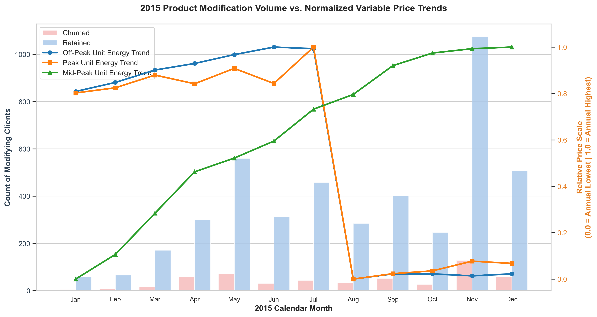

##### 2. The variable Price Chart

* **Observation:**

The overall volatility in pricing trends does not show a strong or consistent correlation with the volume of account modifications for that year.

* **What it means:**
The variable price doesn't seem like a trigger for product plan modification. 

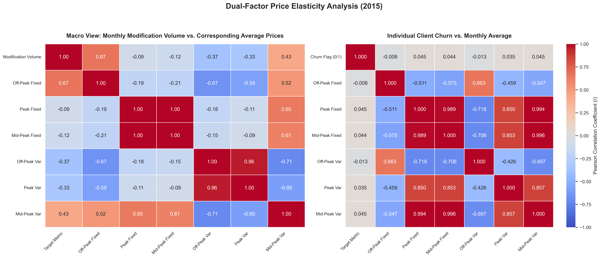

##### 1. Prices and modification date correlation heatmap

* **Observation:** The data shows a severe positive correlation (ranging from 0.85 to 0.88 in key tiers) between rising market prices and the volume of account modifications.

* **What it means:** Customers are highly price-sensitive; when rates spike, they will immediately demand plan adjustments and renegotiations.

##### 2. Prices and churn correlation heatmap

* **Observation:** Across all six pricing tiers, the statistical correlation between the average price a client pays and their likelihood to churn is essentially zero (ranging from -0.046 to +0.046).

* **What it means:** Higher prices do not cause customers to abandon the company. Even though they complain and modify their contracts, the price itself is not driving them to leave.

### Conclusion: 

**An analysis of the 2015 client portfolio challenges the hypothesis that high prices primarily drove customer churn.** Visual trend lines from the year reveal a massive, concentrated surge in contract modifications during the fall months, aligning closely with periods of pricing volatility. This behavioral shift is supported by macro-level correlation data, which shows a strong relationship between price increases and these modifications (with r-values reaching up to 0.88 in key tiers), suggesting the customer base is highly price-sensitive and quick to renegotiate when rates rise. However, despite this aggressive wave of defensive account updates, micro-level data reveals no significant statistical link between the average annual price a client paid and their likelihood to actually leave the company. 

## Recommendations

### 1. Advertising & Acquisition Strategy

The `sale_channel` data shows a major acquisition mismatch across PowerCo's sales streams: One massive channel brings in the highest volume of clients but suffers from a high churn rate(12.14%) compared to the total average(9.7%), while other smaller channels bring in relatively low-churn accounts.
(channels have been renamed, for example, foosdfpfkusacimwkcsosbicdxkicaua→channel 5)

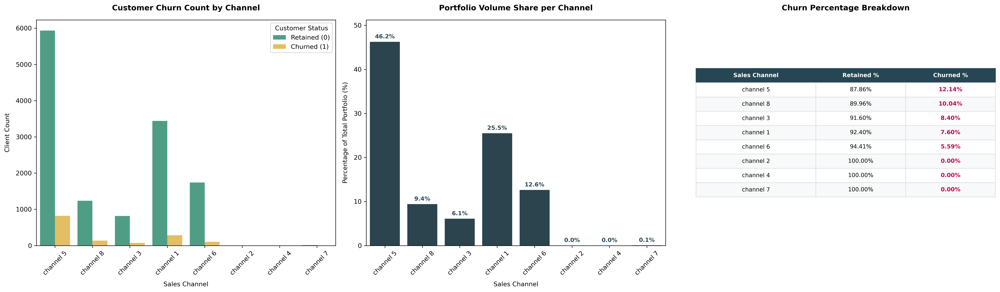

* **Shift Budget to High-Retention Channels:** Move marketing capital away from high-churn sales streams and invest it directly into low-churn channels to protects your revenue and increases long-term customer value.

* **Expand Channel 6 and channel 1 Campaigns:** Increase funding and sales resources specifically for Channel 6 and channel 1, since they  have surprising low churn-rate of 5.59% and 7.60% and big volume of 38.1% of total sale combined. 

### 2. Price Strategy

* **Offer Targeted Fixed-Fee Discounts or Variable Transitions:** While general pricing is not the primary driver of overall customer churn, a substantial segment of business owners are exceptionally sensitive to static fixed-price shifts. To neutralize this trigger, proactively offer direct discounts on high monthly fixed base fees or absorb them into slightly adjusted, predictable variable usage rates. Providing either a lowered flat fee or a utilization-based invoice satisfies their fixed-cost sensitivity and prevents them from exploring competitor offers.

### Assumptions and Caveats

* **Severe Historical Horizon Limit: The pricing dataset (merged_2015_price_df) strictly spans a single calendar year (2015). Because of this complete lack of multi-year historical pricing data, it is impossible to determine if observed behaviors are long-term structural trends or just temporary, one-off seasonal anomalies.**

* **Static Snapshot Constraint: The dataset only tracks a client's latest status and their most recent date of modification. Lacking continuous historical tracking or time-series snapshots makes it difficult to model how an account's consumption habits, contract terms, or pricing plans evolved over time before they decided to churn.**

* **No External Context: The analysis assumes a completely static market landscape. It lacks crucial external datasets, such as aggressive competitor marketing moves, regional utility price shifts, or localized economic health changes that heavily impact client attrition.**

* **Missing Operational Signals: This review relies entirely on transactional numbers. It lacks critical customer-facing touchpoints, such as customer service satisfaction (CSAT) scores, active billing dispute histories, or call center response times, which typically serve as immediate warnings for churn.**