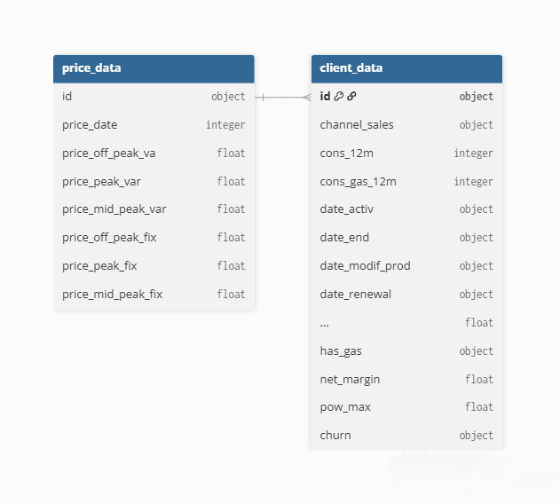

# Power.Co_Churn

## Table of Contents

* [Project Background](#project-background)

* [Project Goals](#project-goals)

* [Project Deep-Dive](#project-deep-dive)

    * [Data Overview](#data-overview)

        *[Client Data](#client-data)

        *[Pricing Data](#pricing-data)

    
* [Recommendations](#recommendations)
* [Clarifying Questions, Assumptions, and Caveats](#clarifying-questions-assumptions-and-caveats)
    * [Questions for Stakeholders Prior to Project Advancement](#questions-for-stakeholders-prior-to-project-advancement)
    * [Assumptions and Caveats](#assumptions-and-caveats)

# 

## Project Background
This project delivers a data science solution engineered by **BCG X** for **PowerCo**, an energy utility provider, to address customer attrition (**churn**). 

 PowerCo leadership operates under the hypothesis that **price sensitivity** is the primary driver of churn, assuming that customers migrate to competitors strictly to obtain lower volumetric or fixed utility rates.Therefore, this project directly investigates the validity of the price sensitivity hypothesis against alternative operational and behavioral variables.

Beyond hypothesis verification, the primary aim of this project is to build an end-to-end predictive framework and deliver actionable business recommendations.

## Project Goals

1. **Audits Client Profiles and Historical Pricing**: Audit customer profiles (electricity & gas consumption, sales channels, net margin etc,) and historical pricing structures and trends to handle **anomalies** and isolate **initial behavioral patterns**.

2. **Hypothesis Verification:** Quantifying the statistical correlation between historical price changes and customer exit rates to evaluate the economic viability of rate restructuring.

3. **Formulate Actionable Business Recommendations**: Translate empirical data insights and risk trends into targeted customer retention strategies, allowing PowerCo to protect annual contract value.

## Executive Summary

TBD
TBD
TBD
TBD

## Project Deep-Dive

### Data Overview

<table>
  <tr>
    <td valign="top" width="300" style="border: none;">
      
    </td>
    <td valign="top" style="border: none; padding-left: 20px;">

* The project utilizes two relational datasets(Client Data and Pricing Data) connected via a one-to-many relationship.

* client_data contains 14,606 rows $\times$ 27 columns and price_data contains 193,002 rows $\times$ 8 columns

* Too see detailed information, [Click here](Data/Data_Description.pdf)

    </td>
  </tr>
</table>

#### Client Data

#### Pricing Data

### Key Product Performance
Analyze which products performed best or worst post-pandemic.

### Customer Growth and Repeat Purchase Trends
Discuss user metrics, retention rates, and customer acquisition data here.

### Loyalty Program Performance
Evaluate whether the loyalty program drove higher revenue or retention.

### Sales by Platforms & Channels
Break down your performance by different sales platforms and distribution channels.

### Refund Rate Trends
Look into the data surrounding returns, cancellations, or refunds.

## Recommendations
Based on your findings above, list your strategic, actionable recommendations for the business.

## Clarifying Questions, Assumptions, and Caveats
An introductory sentence regarding the gaps in the data or initial scope constraints.

### Questions for Stakeholders Prior to Project Advancement
List out questions you would ask data engineering, product managers, or business leaders before taking this project to the next step.

### Assumptions and Caveats
Detail the data limitations, missing timelines, or specific contexts assumed during your EDA.